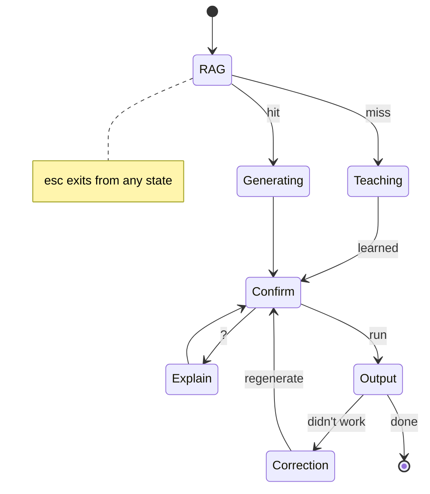

# cmd

A CLI tool that translates natural language into terminal commands.

## Quick Start

**Minimum System Requirements**: MacOS w/ any M Chip, 16GB RAM (need 2GB free)

Install using [`go`](https://go.dev/dl/)

```bash
go install github.com/azvaliev/cmd
```

Generate your commands

```bash
# interactive mode
cmd

# OR one-shot
cmd "find all files over 100MB"
```

## The Problem

You need to find files over 100MB. You ask Claude Code.

20 seconds of spinner. 😵‍💫

It writes a dissertation on filesystem philosophy, then gives you a command with the wrong flags. Three error messages later, you've burned enough tokens to power a small datacenter—all to remember it's -size +100M.

This tool skips the TED talk. Ask, get command, done.

## Design Philosophy

This is a **power tool for flow state**. The interaction should feel like a brief detour, not a context switch.

**Speed over ceremony.** Most interactions should be query → confirm → done.

**Minimal chrome.** Not a fullscreen TUI, not a chat interface. Just enough UI to get the job done.

**Teaching must be frictionless.** When the tool doesn't know a command, teaching it should take seconds, not minutes.

**User always in control.** Escape exits at any point. Nothing runs without confirmation.

## How It Works

Every request flows through a RAG (retrieval-augmented generation) lookup:

| RAG Result | Behavior |
|------------|----------|
| Match found | Inject context, generate command |
| No match | Enter teaching flow |

The presence or absence of relevant retrieved context determines whether the system knows how to help — not the model's self-assessment. Small models hallucinate confidently rather than admitting uncertainty; RAG provides a reliable, deterministic signal.

When you teach the tool a new command, it gets added to the index. The system improves with use.

---

## Development

This project uses Go v1.25, [Task](https://taskfile.dev/) as a task runner, and [Genkit](https://genkit.dev/docs/get-started/?lang=go#install-genkit-packages). I'd recommend installing the genkit CLI.

### Build

```bash
# Release build (stripped, optimized) → dist/release/cmd
task build

# Debug build (debug symbols, no optimizations) → dist/debug/cmd
task build:debug
```

## Interface

The tool has six states:

| State | Purpose |
|-------|---------|
| **Generating** | Command streams in as it's generated. Cancel anytime. |
| **Confirm** | Command ready. Run, explain, copy, or bail. |
| **Explain** | Plain English breakdown of what the command does. |
| **Output** | Command has run. Mark success or report a problem. |
| **Correction** | Something went wrong. Describe the issue, system regenerates. |
| **Teaching** | RAG missed. Tell it what command to learn. |

### State Flow



### Key Bindings by State

| State | Keys |
|-------|------|
| Generating | `esc` cancel |
| Confirm | `enter` run · `?` explain · `c` copy · `esc` cancel |
| Explain | `enter` run · `c` copy · `esc` cancel |
| Output | `enter` done · `!` didn't work · `c` copy cmd · `o` copy output |
| Correction | `enter` submit · `esc` cancel · text input |
| Teaching | `enter` teach · `esc` cancel · text input |

### Terminal Artifacts

All interactive UI happens in an alternate screen buffer. When you exit, only the final command and its output remain in your terminal history — just like if you'd run it yourself.

```
$ cmd sync these folders preserving timestamps
→ rsync -a source/ dest/
sending incremental file list
./
file1.txt
file2.txt
$ _
```

The back-and-forth (corrections, teaching, explanations) vanishes. Only the destination matters.

**Edge cases:**

| Scenario | What's left behind |
|----------|-------------------|
| User cancels before running | Nothing |
| User copies but doesn't run | `→ command (copied)` |
| Command fails (non-zero exit) | Command + error output |

---

## Example Flows

### Happy Path

```
$ cmd find files larger than 100mb

  find . -size +100M

  [enter] run  [?] explain  [c] copy  [esc] cancel
```

Press `enter`:

```
  find . -size +100M
  
  ./videos/recording.mp4
  ./backups/archive.tar

  [enter] done  [!] didn't work  [c] copy cmd  [o] copy output
```

Press `enter`, back to shell.

### Explanation

```
$ cmd extract this tar.gz file

  tar -xzf archive.tar.gz

  [enter] run  [?] explain  [c] copy  [esc] cancel
```

Press `?`:

```
  tar -xzf archive.tar.gz
  
  Extracts a gzipped tar archive into the current directory.
  -x extracts, -z handles gzip compression, -f specifies the file.

  [enter] run  [c] copy  [esc] cancel
```

### Correction

```
$ cmd sync these folders preserving timestamps

  rsync source/ dest/

  [enter] run  [?] explain  [c] copy  [esc] cancel
```

Run it, notice timestamps weren't preserved. Press `!`:

```
  What went wrong? Should I try a different command?
  > it didn't preserve the timestamps

  [enter] submit  [esc] cancel
```

System regenerates:

```
  rsync -a source/ dest/

  [enter] run  [?] explain  [c] copy  [esc] cancel
```

### Teaching

RAG returns nothing relevant:

```
$ cmd show disk usage by folder sorted by size

  Not sure about this one. What command should I look at?
  > ncdu

  [enter] teach  [esc] cancel
```

```
  Learning ncdu...
```

System reads `ncdu --help`, generates:

```
  ncdu .

  [enter] run  [?] explain  [c] copy  [esc] cancel
```

Command is now in the index for next time.

---

## Architecture

### RAG-Centric Design

Every request hits RAG first. This is the gatekeeper — not the model deciding whether it knows something.

```
User query
    ↓
Embed query → Similarity search
    ↓
┌─────────────────────────────────────┐
│  Above similarity threshold?        │
│    Yes → Inject context, generate   │
│    No  → Teaching flow              │
└─────────────────────────────────────┘
    ↓
LLM generates (with context) or user teaches
    ↓
On failure → Correction flow
On teach  → Update RAG index
```

### What Gets Stored

Each command in the index has:

```
{
  command: "rsync",
  description: "sync folders incrementally, skipping unchanged files",
  help_summary: <parsed from --help>,
  example: "rsync -av --update source/ dest/",
  user_queries: ["sync folders skip unchanged", "backup without recopying", ...]
}
```

### Embedding Strategy

Descriptions and user queries are embedded separately, all pointing to the same record. This creates multiple entry points for retrieval:

- **Descriptions** — general, normalized; good for broad matching
- **User queries** — authentic phrasings; captures how people actually ask

The command name itself isn't embedded — it's the payload, not the search key.

### Similarity Threshold

The threshold determines the boundary between "known" and "unknown":

- Too high → frequently triggers teaching for commands that would generate correctly
- Too low → attempts generation with irrelevant context, produces bad results

Start conservative (higher threshold), lower as you observe generation quality with marginal matches.

### Index Updates

The index only updates on failure. If RAG retrieved the command and generation succeeded, nothing changes. Growth comes from genuine gaps, not noise.

When teaching succeeds, the system stores:
- The original query as a new embedding
- An LLM-generated description
- The help output summary
- The working example

### Embedding Consolidation

Over time, popular commands accumulate many query embeddings. When this becomes unwieldy (10+ embeddings for one command):

1. Gather all user queries pointing to that command
2. Generate a candidate consolidated description via LLM
3. **Test it**: embed the candidate and verify it hits similarity threshold against all original queries
4. If it passes, use it and prune redundant embeddings
5. If it fails, iterate — or recognize the command has multiple distinct use cases

The original user queries serve as an automated test suite for description quality.

---

## Key Design Decisions

**RAG as gatekeeper.** The model can't reliably say "I don't know." RAG results (above/below threshold) provide a deterministic signal.

**RAG every request.** No bypass for "known" commands. Consistency simplifies the system and ensures taught commands are always retrieved.

**Embed descriptions, not commands.** Retrieval is natural language to natural language. The command is what you get back, not what you search for.

**Multiple embeddings per command.** Real user queries are valuable signal. A single description can't capture every way someone might ask.

**Update only on failure.** If it worked, leave it alone.

---

## Roadmap

### Phase 1: Core UX

Build the interaction flow end-to-end. No RAG yet — model generates directly.

The goal is to nail the experience: streaming, confirmation, explanation, output, correction, teaching. Get the "brief detour" feel right. Accept that the model might hallucinate; the correction flow handles that.

### Phase 2: RAG Layer

Every request flows through RAG. Above threshold generates with context; below threshold triggers teaching. The teaching flow persists to the index. The system becomes self-improving.

---

## Future Considerations

**Bootstrapping.** Pre-populate the index with common commands to reduce cold-start friction.

**User-specific indexes.** Different users have different workflows and tools. Isolation and personalization.

**Deduplication.** Prevent near-duplicate embeddings from bloating the index.

**Multi-turn / agentic.** Model runs `--help`, parses errors, retries automatically. Adds complexity; may not be needed.

---

## Implementation

Built with Go and [Bubble Tea](https://github.com/charmbracelet/bubbletea), a terminal UI framework implementing the Elm Architecture.
